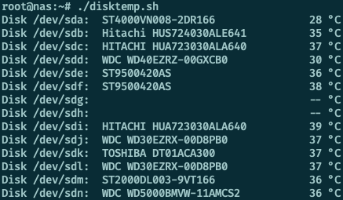

# disktemp

**disktemp** is a simple bash script to print HDD temperatures.



The script will query all devices from /dev/sda to /dev/sdz for their current temperature (utilizing smartctl output) and print it on the console.

## Download

* [Version 1.0.1](https://github.com/jpwenzel/disktemp/archive/main.zip)

## Usage

```# disktemp.sh```

*(run as root)*

## License

See [LICENSE](LICENSE) file.

## Contact

**Jean Pierre Wenzel**

https://github.com/jpwenzel/
